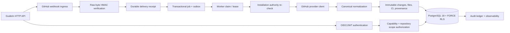

# ✦ GuideIn

<div align="center">

### Evidence-driven change intelligence for software delivery

**A Java 21 control plane that turns repository activity into trusted, tenant-aware change intelligence.**


[](https://www.oracle.com/java/) [](https://spring.io/projects/spring-boot) [](https://www.postgresql.org/) [](#project-status)

<br>

> **GuideIn is evolving from a career-mentor prototype into a trustworthy platform for understanding software change.**


</div>

---

## ✦ What is GuideIn?

GuideIn is a multi-tenant **Change Intelligence Control Plane**. It accepts GitHub events, verifies authenticity, stores durable processing intent, re-fetches canonical provider state, and records immutable change and provenance facts for future analysis.

> **Every change enters production with proof.**

The original Gemini career mentor remains preserved under [`legacy/desktop-v1`](legacy/desktop-v1). The current platform is a Java 21 / Spring Boot modular monolith built around PostgreSQL security boundaries.

## ✦ Architecture



Tenant context is transaction-local and fails closed. Runtime database credentials are separate from migration credentials, and protected tables use PostgreSQL row-level security. Provider data is recorded as evidence; GuideIn does not turn it into release decisions.

## ✦ Phase 2 capabilities

- GitHub App authentication with short-lived RS256 application JWTs
- Secure installation-to-tenant binding with one-use state and PKCE
- Raw request-byte HMAC verification and bounded webhook bodies
- Durable receipts, replay protection, jobs, leases and outbox events
- Installation lifecycle and repository-access authority re-checks
- Canonical pull-request, commit, file, check-run and commit-status normalization
- Immutable revisions keyed by repository, pull request and exact head SHA
- Explicit incomplete file sets when GitHub's provider limit is exceeded
- Typed actor and commit-verification provenance
- Centralized API-versioned, read-only GitHub provider client
- Rate-limit aware durable retry scheduling
- PostgreSQL RLS, audit integrity, tenant isolation and OpenTelemetry correlation

## ✦ Animation system

The preserved desktop experience uses a restrained glossy-dark / ambient visual language. Animations are **slow · soft · subtle · responsive**:

```text
Message entrance:   opacity 0% ─────────→ 100%, position +16px ───→ 0px
Typing indicator:   ● · ·  →  · ● ·  →  · · ●  →  · ● ·
Status indicator:   low-opacity green pulse for active Gemini connection
Ambient background: drifting particles, radial gold glow, gentle breathing
Controls:           eased hover, press, disabled and input-focus transitions
```

These Swing animations remain part of the project's history and design direction while active platform work focuses on trustworthy ingestion.

## ✦ Project status

### Completed and proven

- [x] Phase 1 platform kernel: identity, tenancy, authorization, RLS, audit, outbox, jobs, observability and health semantics
- [x] Phase 2 GitHub trustworthy ingestion implementation
- [x] PostgreSQL 18.6 proof from fresh databases and all migrations from zero
- [x] 133/133 final clean tests, with no Phase-1 or Phase-2 proof skips
- [x] 10,000-delivery replay with process-crash recovery and zero duplicate semantic effects
- [x] JWT/HMAC adversarial tests, installation lifecycle tests and repository-scope tests
- [x] PR, commit, file, CI and provenance normalization

See the [Phase 2 evidence report](reports/PHASE_2_REPORT.md) and [machine-readable results](evaluation/phase2-results.json).

### Next planned work

Phase 3 will be planned separately and is intentionally **not included in this repository state**. Future work may build graph consumers and policy views on top of the immutable, tenant-scoped evidence already captured here.

## ✦ Run locally

Requirements: Java 21, Maven 3.9+, and Docker with Compose.

```powershell
Copy-Item .env.example .env
docker compose up -d postgres
mvn -Dmaven.repo.local=.m2/repository verify
```

The API expects a JWT from the configured OIDC issuer. There is no password or development authentication bypass. Use development-only credentials in `.env`; never commit secrets.

## ✦ Repository layout

```text
backend/       Java/Spring Boot platform modules and PostgreSQL migrations
contracts/     API contracts
docs/          ADRs, research and operations guidance
evaluation/    measured proof results
reports/       completion report and defect journal
legacy/        original Gemini/Swing career mentor
```

## ✦ Design philosophy

```text
Authenticity + Tenant boundaries + Durable evidence + Immutable facts
                              =
                    Trustworthy change intelligence
```

GuideIn is built by learning through implementation, measurement and failure analysis. Defects discovered during proof remain visible in the defect journal so the project history shows how trust was earned.

<div align="center">

### Built by **Sufiyan Khan**

**Learning by building. Improving by breaking things. Understanding how everything works under the hood.**

`Java` · `Spring Boot` · `PostgreSQL` · `GitHub` · `Security` · `Observability`

</div>
