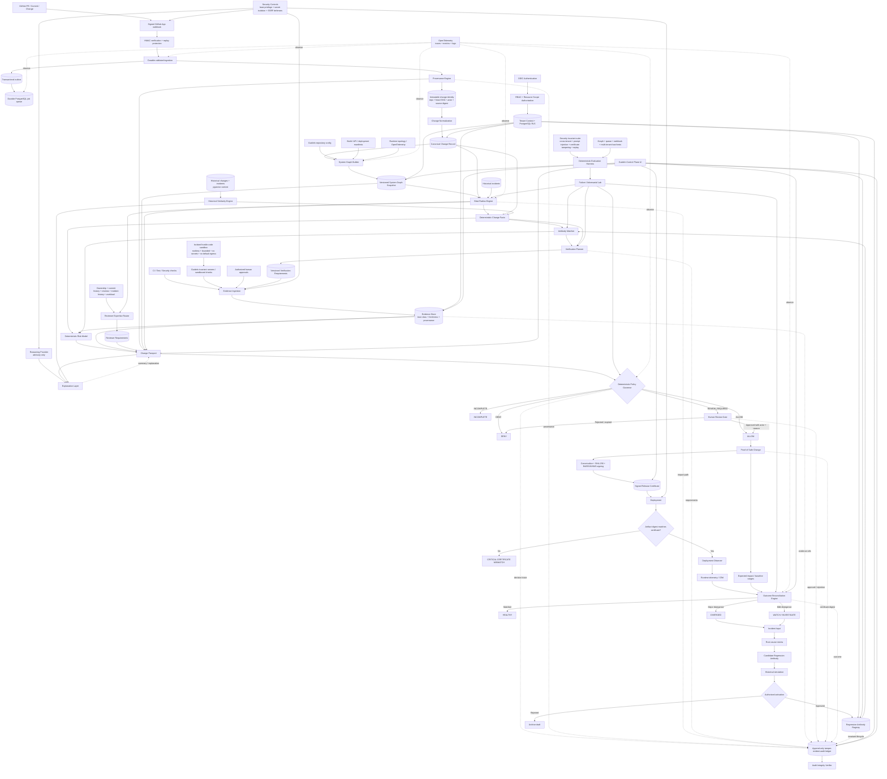

```mermaid
flowchart TD

    GitHub[GitHub PR / Commit / Change] --> Webhook[Signed GitHub App webhook]
    Webhook --> ReplayGuard[HMAC verification + replay protection]
    ReplayGuard --> Ingest[Durable validated ingestion]
    Ingest --> Outbox[(Transactional outbox)]
    Outbox --> Jobs[(Durable PostgreSQL job queue)]

    Ingest --> Provenance[Provenance Engine]
    Provenance --> Identity[(Immutable change identity<br/>repo + head SHA + actor + source digest)]

    Identity --> Normalize[Change Normalization]
    Normalize --> Change[(Canonical Change Record)]

    Change --> GraphBuild[System Graph Builder]
    RepoConfig[GuideIn repository config] --> GraphBuild
    Manifests[Build / API / deployment manifests] --> GraphBuild
    RuntimeTopo[Runtime topology / OpenTelemetry] --> GraphBuild

    GraphBuild --> Graph[(Versioned System Graph Snapshot)]

    Graph --> Blast[Blast Radius Engine]
    Change --> Blast
    Incidents[(Historical incidents)] --> Blast

    Blast --> RiskFacts[Deterministic Change Facts]
    Change --> RiskFacts

    Historical[(Historical changes + incidents<br/>pgvector context)] --> Similarity[Historical Similarity Engine]
    Similarity --> RiskFacts

    Antibodies[(Regression Antibody Registry)] --> AntibodyMatch[Antibody Matcher]
    RiskFacts --> AntibodyMatch

    AntibodyMatch --> VerifyPlan[Verification Planner]
    RiskFacts --> VerifyPlan

    VerifyPlan --> Requirements[(Versioned Verification Requirements)]

    CI[CI / Test / Security checks] --> Evidence[Evidence Ingestion]
    RuntimeProof[GuideIn invariant runners / sandboxed checks] --> Evidence
    HumanReview[Authorized human approvals] --> Evidence
    Requirements --> Evidence

    Evidence --> EvidenceStore[(Evidence Store<br/>trust class + freshness + provenance)]

    RiskFacts --> RiskEngine[Deterministic Risk Model]
    EvidenceStore --> RiskEngine
    AntibodyMatch --> RiskEngine

    ReviewSignals[Ownership + commit history + reviews + incident history + workload] --> ReviewerRouter[Reviewer Expertise Router]
    Blast --> ReviewerRouter
    ReviewerRouter --> ReviewerReq[(Reviewer Requirements)]

    RiskEngine --> Passport[Change Passport]
    EvidenceStore --> Passport
    ReviewerReq --> Passport
    Provenance --> Passport
    Graph --> Passport
    Blast --> Passport

    LLM[Reasoning Provider<br/>advisory only] --> Explain[Explanation Layer]
    Passport --> Explain
    Similarity --> Explain
    Explain -. summary / explanation .-> Passport

    Passport --> Policy{Deterministic Policy Governor}

    Policy -->|DENY| Deny[DENY]
    Policy -->|INCOMPLETE| Incomplete[INCOMPLETE]
    Policy -->|REVIEW_REQUIRED| HumanGate[Human Review Gate]
    Policy -->|ALLOW| Allow[ALLOW]

    HumanGate -->|Approved with actor + reason| Allow
    HumanGate -->|Rejected / expired| Deny

    Allow --> Certificate[Proof of Safe Change]
    Certificate --> Sign[Canonicalize + SHA-256 + Ed25519/KMS signing]
    Sign --> SignedCert[(Signed Release Certificate)]

    SignedCert --> Deploy[Deployment]
    Deploy --> ArtifactCheck{Artifact digest matches certificate?}

    ArtifactCheck -->|No| Mismatch[CRITICAL CERTIFICATE MISMATCH]
    ArtifactCheck -->|Yes| Observer[Deployment Observer]

    Observer --> Telemetry[Runtime telemetry / OTel]
    Telemetry --> Reconcile[Outcome Reconciliation Engine]

    Expected[Expected impact / baseline ranges] --> Reconcile
    Certificate --> Expected

    Reconcile -->|Matched| Healthy[HEALTHY]
    Reconcile -->|Mild divergence| Watch[WATCH / INVESTIGATE]
    Reconcile -->|Major divergence| Diverged[DIVERGED]

    Diverged --> Incident[Incident Input]
    Watch --> Incident

    Incident --> RootCause[Root-cause review]
    RootCause --> DraftAb[Candidate Regression Antibody]
    DraftAb --> Simulate[Historical simulation]
    Simulate --> Approval{Authorized activation}
    Approval -->|Approved| Antibodies
    Approval -->|Rejected| Archive[Archive draft]

    Policy -. decision trace .-> Audit[(Append-only tamper-evident audit ledger)]
    Provenance -. provenance .-> Audit
    Blast -. impact path .-> Audit
    VerifyPlan -. requirements .-> Audit
    EvidenceStore -. evidence refs .-> Audit
    HumanGate -. approval / rejection .-> Audit
    Certificate -. certificate digest .-> Audit
    Reconcile -. outcome .-> Audit
    Antibodies -. invariant lifecycle .-> Audit

    Audit --> Integrity[Audit Integrity Verifier]

    Auth[OIDC Authentication] --> Access[RBAC + Resource Scope Authorization]
    Access --> Tenant[(Tenant Context + PostgreSQL RLS)]
    Tenant --> Change
    Tenant --> Graph
    Tenant --> EvidenceStore
    Tenant --> Antibodies
    Tenant --> Audit

    Security[Security Controls<br/>least privilege + secret isolation + SSRF defenses] --> Webhook
    Security --> Evidence
    Security --> LLM
    Security --> Deploy

    Sandbox[Isolated hostile-code sandbox<br/>rootless + bounded + no secrets + no default egress] --> RuntimeProof

    Evaluation[Deterministic Evaluation Harness] --> FailureLab[Failure / Adversarial Lab]
    FailureLab --> Policy
    FailureLab --> Blast
    FailureLab --> VerifyPlan
    FailureLab --> AntibodyMatch
    FailureLab --> Reconcile

    SecurityTests[Security invariant suite<br/>cross-tenant + prompt injection + certificate tampering + replay] --> Evaluation
    ScaleTests[Graph + queue + webhook + multi-tenant load tests] --> Evaluation

    OTel[OpenTelemetry<br/>traces + metrics + logs] -. observe .-> Ingest
    OTel -. observe .-> Jobs
    OTel -. observe .-> GraphBuild
    OTel -. observe .-> Blast
    OTel -. observe .-> Policy
    OTel -. observe .-> Reconcile

    Dashboard[GuideIn Control Plane UI] --> Passport
    Dashboard --> Graph
    Dashboard --> EvidenceStore
    Dashboard --> Antibodies
    Dashboard --> Reconcile
    Dashboard --> Audit
    Dashboard --> SignedCert
```
